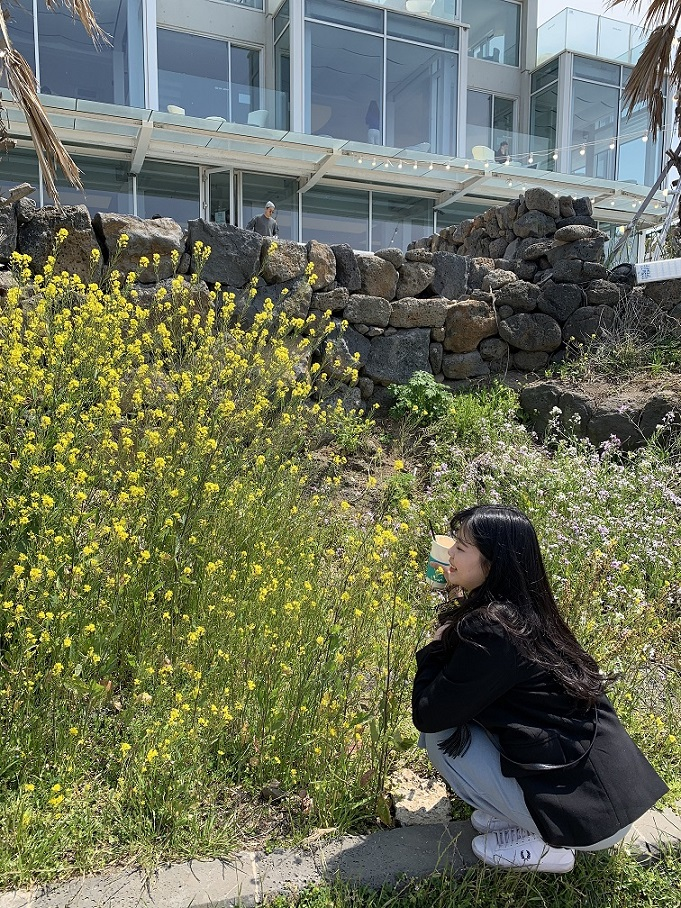
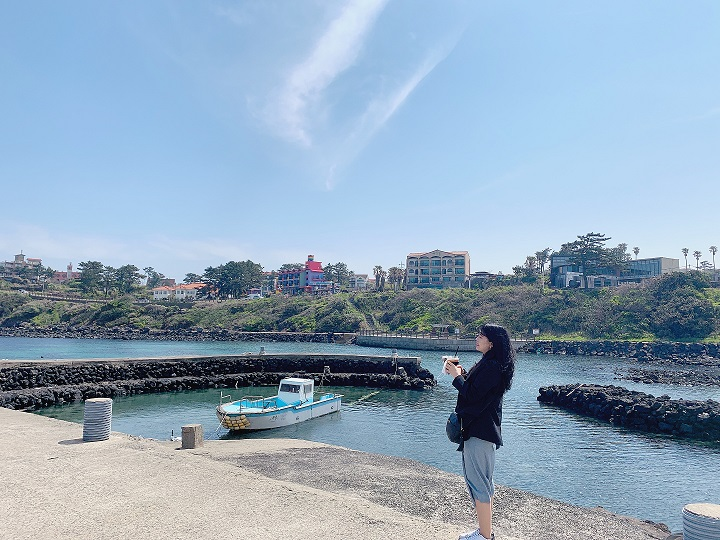
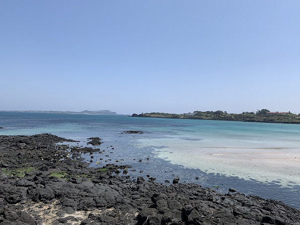

👋 안녕하세요. 블로그 방문에 감사합니다.

제주도는 사계절 내내 방문하기 좋은 섬입니다. 저는 고등학생 시절 수학여행으로 딱 한번 방문하였던것을 제외하고는 제주도를 마음껏 여행해본 경험이 없었습니다만 근래에 기회가 생겨 다녀오게 되었습니다. 

이왕에 가는 여행 정말 제대로 다녀오고 싶어 긴 시간을 투자하여 계획을 세우고 맛집을 선정하였고, 아주 만족스러운 여행이 되었습니다.

그래서 봄의 제주도 여행 후기와 제가 다닌 호텔 및 식당을 추천해드리고 싶어 글을 작성합니다. 

이번 글은 자세한 리뷰보다는 제주도의 느낌을 보여드리고 싶어 쓰는 글이니 가볍게 봐주시면 감사하겠습니다. (그냥 제 사진 올리고 싶었어요)

봄하면 꽃구경 제주도하면 유채꽃이죠. 제주도는 이곳저곳에 유채꽃이 만발해있었습니다.

첫날 묵었던 다인 오세아노 호텔의 앞입니다. 본격적인 해변가의 느낌이랑은 거리가 있었지만 그래도 벌써부터 청량한 느낌이 보여 기대가 되었습니다. 
 

제주도에 돌이 많다고 말로만 들었지 어느 해변을 가던 현무암이 쌓여 있어서 제주 바다만의 특징을 느낄 수 있었습니다. 검은색과 푸른색의 색조합이 너무 잘어울려서 눈이 즐거웠어요.

제주도 여행 맛보기 포스팅 잘 보셨나요?
앞서 말씀드렸다시피 다음 포스팅부터는 본격적인 제주도 호텔과 식당에 대한 리뷰를 올릴 예정입니다. 앞으로 많은 관심 부탁드립니다. 감사합니다.

